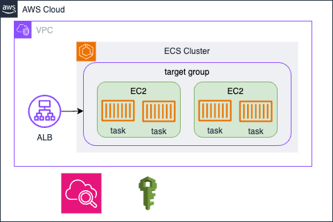

# Archtecture in AWS

The document provides the Cloud archtecuture design in AWS and how these AWS resources defined using Terraform.

## Archtecuture Design

The Strapi project archtecuture diagram shows as below.



Here is the main AWS resources created in the projects:

- ECS Task execution IAM Role
- ECS Task IAM Role
- Application Load Balancer
- ECS Service
- ECS Task Definition
- Load Balancer Target Group
- CloudWatch Logs Groups, Alarms, etc.

## Project Structure

All Terraform resources are defined in `terraform` directory. The source code structure shows as below. There is a `Makefile` under root directory that defines several targets to execute, which is useful to exeucte terraform CLI from terminal. See [Markfile Tutorial][1] to get more details about `Makefile`.

```bash
.
├── 01_data.tf                      # defines terraform data source
├── 01_local.tf                     # defines terraform local variables
├── 01_providers.tf                 # defines terraform version and provides definition
├── 01_variables.tf                 # defines terrafrom variables definition
├── 02_alb.tf                       # defines terraform resource loadbalancer
├── 02_ecs.tf                       # defines terraform resources like ECS service, task defintion, etc
├── 02_roles.tf                     # defines terraform resources IAM roles
├── 03_outputs.tf
├── environments                    # provides the value of terrafrom variables per environment
│   ├── dev.tfvars
│   └── prod.tfvars
└── modules                         # defines terraform modules
    └── iam
        ├── 01_data.tf
        ├── 01_variables.tf
        ├── 02_main.tf
        └── 03_outputs.tf
```

## Setup AWS CLI and Terraform

If you want to deploy Terraform resources into AWS from your local machine, you must setup AWS credentials and Terraform environment on the machine.

### 1. Install AWS CLI

Follows [Install or update the latest version of the AWS CLI][5] to install AWS CLI V2 on your machine.

```bash
aws --version
# aws-cli/2.11.3 Python/3.11.2 Darwin/21.6.0 exe/x86_64 prompt/off
```

### 2. Setup AWS Credentials

After installing AWS CLI, you must setup AWS credentials on the machine so that you can deploy Terraform resources to AWS account. AWS provides a detailed document to introduce how to setup AWS credentials based on different AWS authentication methods. In this project, I choose long-term credentials which is not recommended in a real project because of security risks. Follow [Authenticate with IAM user credentials][4] to setup AWS credentials.

> When you attach policies for your IAM user, choose `AdministratorAccess` in order to deploy AWS resources. As I'm going to reuse this IAM user to deploy a batch of AWS resources, attach `AdministratorAccess` is pretty easiler, but lack of security. You should keep it in mind.

Use a named profile, for exmaple `app-deployer` instead of `default` if you have multiple profiles.

```bash
# ~/.aws/credentials
[app-deployer]
aws_access_key_id = <aws_access_key_id>
aws_secret_access_key = <aws_access_key_id>

# ~/.aws/config
[profile app-deployer]
region = ap-southeast-1
output = json
```

Run `aws sts get-caller-identity --profile app-deployer` to validate if the crendetial works. You should get output as below.

```json
{
  "UserId": "XXXXXXXXXXXXXXXXXXXX",
  "Account": "123456789012",
  "Arn": "arn:aws:iam::123456789012:user/user1"
}
```

### 3. Install Terraform

The project needs Terraform greater than `1.4.2` to be installed if you want to execute Terraform CLI from local machine. See [Install Terraform][2] for the details. I recommend to use [tfenv][3] which is a great tool to manage multiple Terraform version smoothly.

Terraform official AWS provider is the only provider we used in the project.

```json
terraform {
  backend "s3" {}

  required_version = ">= 1.4.2"
  required_providers {
    aws = {
      source  = "hashicorp/aws"
      version = "~> 5.25.0"
    }
  }
}
```

### 4. Terraform CLI

After Terraform get installed from previous step, generate a `.env` file from `.env.example`, and replace environment variable as needed. The Makefile will read enviornment variable from `.env` and injected into Terraform CLI via options `-var`.

#### a. General Variables

A `.env` file will be generated with general variables when you start the Strapi application successfully. These variables will be used for Strapi application authentication.

#### b. Database Variables

For Strapi application, you should have a Database setup for data persistance. See the database configuration from `config/database.js`. In the project, we use `mysql` engine and pre-launched a RDS Mysql instance in the same AWS account.

```yaml
DATABASE_CLIENT=mysql
DATABASE_USERNAME=tobemodified      # the username of database that you provided when creating RDS instance
DATABASE_PASSWORD=tobemodified      # the password of database that you provided when creating RDS instance
DATABASE_HOST=tobemodified          # the endpoint of RDS instance
```

#### c. Terraform Variabless

```yaml
# Terraform Variables
AWS_ACCOUNT=123456789012            # the AWS account id you are going to deploy the Strapi project
AWS_PROFILE=tobemodified            # the AWS profile you provided when setup AWS credentials in ~/.aws/credentials (Linux/Mac OS only)
AWS_REGION=tobemodified             # the AWS region you are going to deploy the Strapi project
STATE_BUCKET=tobemodified           # the S3 bucket name for Terraform state bucket
ENVIRONMENT=dev                     # the target environment (Only used for multiple environments deployment)
NICKNAME=strapi                     # the nickname of project (Used for tagging and unique AWS resources
IMAGE=tobemodified                  # the Docker image of Strapi application
DESIRED_COUNT=1                     # the desired ECS task count you want to launch
```

After done, move to next step to execute Terraform CLI via `Makefile` targets.

```bash
# Format and validate terraform code
make lint

# Init terraform and create a plan, a tfplan file will be generated
make plan
# or run make plan-destroy to create a destroy plan

# Apply the tfplan to AWS
make apply
```

[1]: https://makefiletutorial.com/#getting-started
[2]: https://developer.hashicorp.com/terraform/tutorials/aws-get-started/install-cli
[3]: https://github.com/tfutils/tfenv
[4]: https://docs.aws.amazon.com/cli/latest/userguide/cli-authentication-user.html
[5]: https://docs.aws.amazon.com/cli/latest/userguide/getting-started-install.html
